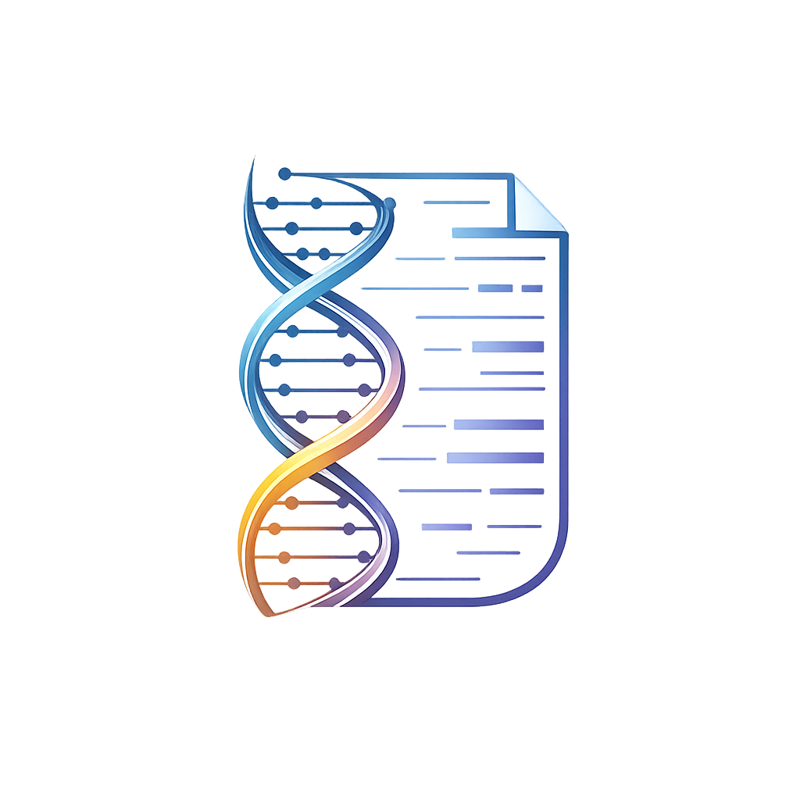

<div align="center">
  
  <br><br>

  # ✦ A R T I U S &nbsp; L A B

  **AI-Powered Resume Builder — Craft Resumes That Command Attention**

 <br>

  
  
  
  
  
  

  <br>

  <sub>Choose a template → Fill your details → AI enhances your content → Download a stunning PDF</sub>

</div>

<br>

---

<br>

## ✨ Features

<table>
<tr>
<td width="50%">

### 🎨 Premium Templates
5 professionally designed templates — each optimized for ATS compatibility and visual impact across different industries.

</td>
<td width="50%">

### 🤖 AI-Powered Enhancement
Google Gemini AI analyzes your content, adds action verbs, quantifies achievements, and optimizes for ATS keywords.

</td>
</tr>
<tr>
<td>

### 📝 Multi-Step Form Builder
Intuitive 5-step wizard: Personal Info → Education → Experience → Skills → Projects. Add unlimited entries per section.

</td>
<td>

### 📄 Instant PDF Download
WeasyPrint renders pixel-perfect HTML/CSS templates into beautiful, print-ready PDF resumes in seconds.

</td>
</tr>
</table>

<br>

## 🎯 Templates

| Template | Style | Best For |
|:---|:---|:---|
| **Modern Minimalist** | Clean sans-serif, indigo accents, pill-shaped skill tags | Tech, Design, Startups |
| **Executive Classic** | Serif two-column, navy palette, formal dividers | Corporate, Finance, Executive |
| **Creative Studio** | Gradient header, pink/purple palette, card-style projects | Design, Marketing, Creative |
| **Tech Professional** | Dark header, monospace accents, code-style sections | Engineering, Data Science, DevOps |
| **Elegant Serif** | Gold accents, Garamond typography, centered layout | Academia, Publishing, Law |

<br>

## 🛠 Tech Stack

```
Frontend                          Backend
├── Next.js 16 (App Router)       ├── FastAPI
├── TypeScript                    ├── Google Gemini 2.0 Flash
├── Tailwind CSS v4               ├── WeasyPrint (PDF)
├── React 19                      ├── Jinja2 (Templates)
└── Glassmorphism UI              └── Pydantic (Validation)
```

<br>

## 🚀 Getting Started

### Prerequisites

- **Node.js** 18+
- **Python** 3.9+
- **Google Gemini API Key** — [Get one here](https://aistudio.google.com/apikey)

### 1. Clone

```bash
git clone https://github.com/ErebAsh/artius-lab.git
cd artius-lab
```

### 2. Backend Setup

```bash
cd backend
pip install -r requirements.txt
```

Create a `.env` file in the `backend/` directory:

```env
GEMINI_API_KEY=your_gemini_api_key_here
```

Start the server:

```bash
uvicorn main:app --reload --port 8000
```

### 3. Frontend Setup

```bash
cd frontend
npm install
npm run dev
```

### 4. Open

Navigate to **[http://localhost:3000](http://localhost:3000)** and start building your resume! 🎉

<br>

### 🐳 Docker (Alternative)

```bash
docker-compose up --build
```

> **Note:** Make sure to set `GEMINI_API_KEY` as an environment variable or in `backend/.env` before running.

<br>

## 📁 Project Structure

```
artius-lab/
├── frontend/                    # Next.js 16 Application
│   └── app/
│       ├── page.tsx             # Landing page
│       ├── templates/
│       │   └── page.tsx         # Template gallery
│       ├── builder/
│       │   └── page.tsx         # Multi-step form wizard
│       ├── components/
│       │   ├── Navbar.tsx       # Floating glass navbar
│       │   ├── TemplateCard.tsx # Template preview card
│       │   ├── TemplateModal.tsx# Template detail modal
│       │   └── LoadingOverlay.tsx# AI processing animation
│       ├── globals.css          # Design system
│       └── layout.tsx           # Root layout
│
├── backend/                     # FastAPI Application
│   ├── main.py                  # API endpoints
│   ├── schemas.py               # Pydantic models
│   ├── templates.py             # Template registry
│   ├── ai_service.py            # Gemini AI integration
│   ├── pdf_service.py           # PDF generation
│   └── resume_templates/        # Jinja2 HTML templates
│       ├── modern.html
│       ├── classic.html
│       ├── creative.html
│       ├── tech.html
│       └── elegant.html
│
├── docker-compose.yml
└── README.md
```

<br>

## 🔌 API Reference

| Method | Endpoint | Description |
|:---|:---|:---|
| `GET` | `/api/templates` | List all available templates |
| `GET` | `/api/templates/{id}` | Get template details by ID |
| `POST` | `/api/generate` | Generate AI-enhanced PDF resume |

<details>
<summary><b>POST /api/generate</b> — Request Body</summary>

```json
{
  "template_id": "modern",
  "personal_info": {
    "full_name": "John Doe",
    "email": "john@example.com",
    "phone": "+1 234 567 890",
    "location": "San Francisco, CA",
    "linkedin": "linkedin.com/in/johndoe",
    "portfolio": "johndoe.dev",
    "summary": "Senior Software Engineer with 5+ years..."
  },
  "education": [...],
  "experience": [...],
  "skills": [...],
  "projects": [...]
}
```

**Response:** PDF file (`application/pdf`)

</details>

<br>

## 🗺️ Roadmap

- [ ] Live resume preview before download
- [ ] Template customization (colors, fonts)
- [ ] Multiple export formats (DOCX, LaTeX)
- [ ] Resume scoring & feedback
- [ ] User accounts & saved resumes
- [ ] Job description matching

<br>

---

<br>

<div align="center">

## 🔗 Connect

<a href="https://github.com/ErebAsh"></a>
&nbsp;
<a href="https://www.linkedin.com/in/himanshurajjnu"></a>
&nbsp;
<a href="mailto:hr7207096@gmail.com"></a>

<br><br>

**Built with ❤️ by [Himanshu Raj](https://github.com/ErebAsh)**

<sub>⭐ If you found this useful, consider giving it a star — it means a lot!</sub>

</div>
