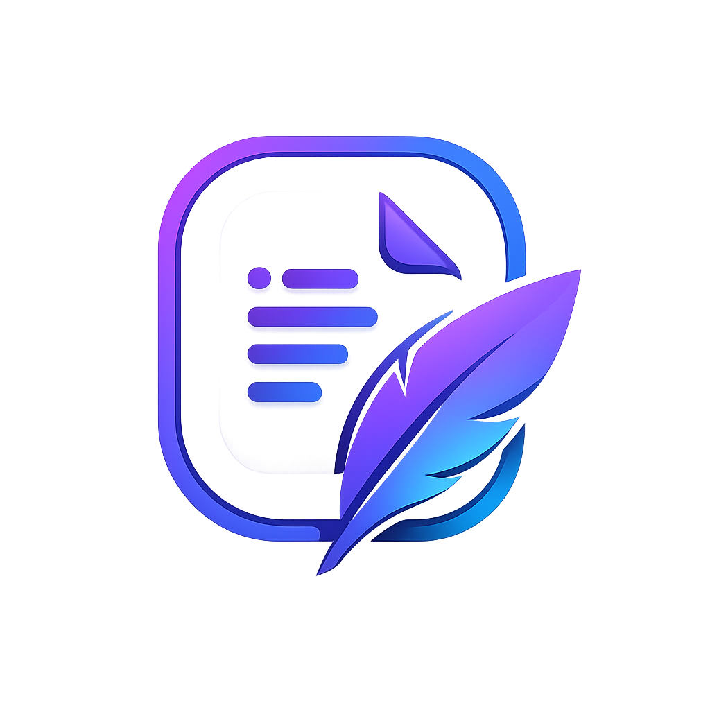

<div align="center">
  

  <br>

  <b><font size="7">✦ A R T I U S &nbsp; L A B ✦</font></b>

  **AI-Powered Resume Builder** <br> Build professional, ATS-friendly resumes in minutes using AI.

 <br>

  
  
  
  <br>
  
  
  
  <br>
  
  

</div>

<br>

## 🧪 About Artius Lab

The word Artius Lab is derived from the Latin root art, meaning skills and craftsmanship, with the suffix ius giving it a refined and timeless character, representing a mastery of excellence in creative works. Lab represents a place of experimentation and innovation, where ideas are transformed into reality. Combined, it means a laboratory where art meets intelligence to create something truly exceptional.

## ⚙️ How It Works

It is an AI-based resume builder where users can create a resume simply by following these steps:

1. Choose a template from the template gallery.
2. Fill in the respective personal details such as name, contact information, work experience, education, and skills through an intuitive multi-step form.
3. After filling in the details, let the LLM enhance the resume content with professional descriptions, action verbs, and ATS-friendly formatting.
4. When done, it will generate a high-quality PDF that can be downloaded from the preview page (also editable manually if needed).
  
<sub><div align="center">***Choose a template → Fill your details → AI enhances your content → Download a stunning PDF***</div></sub>
<br>


## 🎯 Templates

Artius Lab now features **a variety of high-fidelity templates** from our premium **AL-Series**. Each template is meticulously crafted for maximum impact and ATS readability.

| ID | Template Name | Style | Category |
|:---|:---|:---|:---|
| **AL-001** | ATS Standard Pro | Clean single-column, professional | Technical |
| **AL-002** | Modern Timeline | Stylish sidebar, experience timeline | Modern |
| **AL-004** | Navy Gold Corporate | High-end corporate, project-focused | Professional |
| **AL-021** | Graphic Hex Red | Hexagonal photo frame, bold accents | Creative |
| **AL-025** | Script Font Elegant | Script typography, horizontal bands | Creative |
| **AL-030** | Navy Gold Arch | Architectural layout, gold accents | Executive |
| **AL-035** | Deep Red Border | Classic serif, clean two-column | Professional |
| **AL-038** | Horizontal Bars | Bold sidebar bars, circular photo | Modern |

*...and many more professional designs available in the gallery.*

<br>

## 🛠 Tech Stack

```
Frontend                          Backend
├── Next.js 16 (App Router)       ├── FastAPI (Python)
├── TypeScript                    ├── Google Gemini 2.5 Flash
├── Tailwind CSS v4               ├── WeasyPrint (PDF Engine)
├── Lucide Icons                  ├── Jinja2 (HTML Templates)
└── Glassmorphism UI              └── SQLite (Database)
```

<br>

## 🚀 Getting Started

### Prerequisites

- **Node.js** 18+
- **Python** 3.9+
- **Google Gemini API Key** — [Get one here](https://aistudio.google.com/apikey)

### 1. Clone

```bash
git clone https://github.com/ErebAsh/artius-lab.git
cd artius-lab
```

### 2. Backend Setup

```bash
cd backend
pip install -r requirements.txt
```

Create a `.env` file in the `backend/` directory:

```env
GEMINI_API_KEY=your_gemini_api_key_here
JWT_SECRET=your_secret_key_here
```

Start the server:

```bash
uvicorn main:app --reload --port 8000
```

### 3. Frontend Setup

```bash
cd frontend
npm install
npm run dev
```

### 4. Open

Navigate to **[http://localhost:3000](http://localhost:3000)** and start building your resume! 🎉

<br>

### 🐳 Docker (Alternative)

```bash
docker-compose up --build
```

<br>

## 📁 Project Structure

```
artius-lab/
├── frontend/                    # Next.js 16 Application
│   ├── app/
│   │   ├── page.tsx             # Home
│   │   ├── ats/                 # ATS Checker
│   │   ├── modifier/            # AI Resume Editor
│   │   ├── builder/             # Multi-step Form Builder
│   │   ├── resumes/             # Saved Drafts
│   │   ├── settings/            # User Profile
│   │   └── templates/           # Template Library
│   └── components/              # UI Components
│
├── backend/                     # FastAPI Application
│   ├── main.py                  # API Gateway
│   ├── auth.py                  # JWT & Auth Logic
│   ├── database.py              # SQLite & SQLModel/CRUD
│   ├── ai_service.py            # Gemini Integration
│   ├── pdf_service.py           # HTML/PDF Rendering
│   └── resume_templates/        # 38+ Jinja2 Templates (AL-Series)
│
└── docker-compose.yml
```

<br>

## 🔌 API Reference

| Method | Endpoint | Description |
|:---|:---|:---|
| `POST` | `/api/auth/register` | Create a new account |
| `POST` | `/api/auth/login` | Authenticate and get JWT |
| `GET` | `/api/templates` | List all available templates |
| `POST` | `/api/ai/enhance` | AI-enhance resume data |
| `POST` | `/api/resume/modify` | Conversational resume editing |
| `POST` | `/api/ats/upload` | PDF ATS analysis & scoring |
| `GET` | `/api/resumes` | Fetch saved resume drafts |

<br>

## 🗺️ Inspiration Behind the Project

When I was creating my resume for the first time, I got confused about the section format and what to write in each section. I also struggled to find a good free tool to create a simple resume. I found many tools, but they were either paid or had very limited free features. Free tools lacked automated summary and content enhancement features, while manual tools led to issues with grammar, punctuation, and formatting.

So, I decided to build a resume builder that is free and includes all the features a user needs, ensuring that others do not face the same problems I did. I am still working on this project and continuously adding new features. I am open to suggestions and contributions to improve it further. I hope this project helps many people create their resumes easily and effectively.
<br> <br>

<div align="center">


***Have feedback or suggestions, or just want to connect? Don’t hesitate to reach out!***
<br>

<a href="https://github.com/ErebAsh"></a>
&nbsp;
<a href="https://www.linkedin.com/in/himanshurajjnu"></a>
&nbsp;
<a href="mailto:hr7207096@gmail.com"></a>

**Built with ❤️ by [Himanshu Raj](https://github.com/ErebAsh)**

<sub>**If you found this useful, consider giving it a star ⭐ — it means a lot!**</sub><br>
<sub>Thanks for giving your valuable time!</sub>

</div>
